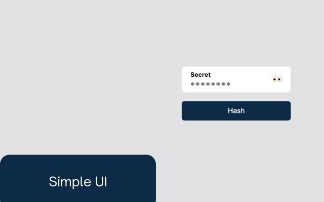

# Secret hash

> Chrome extension to secretly hash texts.

Secret Hash Chrome Extension allows you to quickly hash texts without exposing
the text, the generated hash and the algorithm used.

This extension differ from a regular hash generator because it does not expose
the text you want to hash, neither the hash generated and the algorithm used to
hash. This is useful if you you rely on hashes to access resources, accounts,
databases, and are sharing your screen with your colleagues and need to generate
a hash.



## Development

This extension is built on [React](https://reactjs.org/) with some
[Webpack](https://webpack.js.org/) tweaks to generate a `dist` folder compatible
with the Chrome Extesion standards.

### Running the project locally

To run the project locally in development mode you need to follow the steps
below:

1. Start the project in development mode:

```command
npm run develop
```

2. Open Google Chome and navigate to the url `chrome://extensions/`.
3. In the top right corner, enable Developer mode.
4. Click the **Load unpacked** button.
5. Select the `dist` folder inside the project directory.6. Now the Chrome
   Extension will be enabled inside the Chrome **Extensions** tab.
6. Happy hacking!

To build the production version of the project:

```command
npm run build
```
